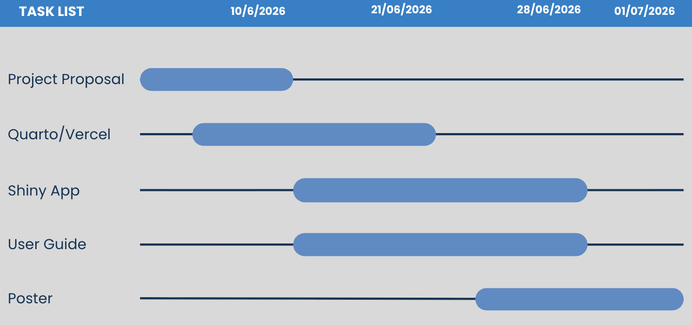

## Overview

Our objective is to investigate TenantThread’s internal communications
during the two weeks leading up to the embargo breach and reconstruct
the sequence of events that preceded it. The dataset contains
communications generated by AI-assisted agents responsible for managing
TenantThread’s corporate communications, including messages, internal
deliberations, and public-facing posts.

Using visual analytics techniques, this project aims to uncover
communication patterns, decision-making processes, and behavioural
changes that contributed to the inappropriate release of merger-related
information.

Specifically, the investigation seeks to answer the following question:

Did TenantThread’s team deliberately leak confidential merger
information, or was the release the result of broader failures in
governance, coordination, and compliance under organisational pressure?

## Objectives

This project aims to develop an interactive visual analytics dashboard
to support the investigation of the TenantThread embargo breach. The
dashboard enables users to explore communication patterns, behavioural
changes, and information flows leading up to the inappropriate release
of merger-related information.

1.  **Network Metric Analysis:** Examine how communication structures
    and agent relationships evolved before and after the embargo breach.
    Identify key communication hubs, influential agents, and changes in
    network centrality associated with the release. Adjust the degree of
    betweenness, timeline, different agents (nodes).

2.  **Keyword Embedding Visualisations used in TenantThread’s
    communication channels:** Explore communication topics through
    keyword-based visualisations such as Word Clouds, TF-IDF analysis,
    and Semantic Networks. Identify dominant discussion themes and
    investigate how merger-, risk-, and crisis-related topics changed
    over time. Adjust the distance sensitivity as well as the specific
    distance metrices.

3.  **Swimlane Plot:** Present an interactive timeline showing each
    agent’s declared behaviour versus actual communication behaviour
    over time.  Prosposed indicators include Behaviour Mismatch Count,
    Compliance Violations, Agent Risk Ranking and Behaviour Consistency
    Score.

**Interactive Data Tables**: Provide searchable and filterable data
tables that allow users to inspect individual communication records,
verify findings from visualisations, and examine communication details
at a granular level.

## Data

The project will examine the data from VAST Challenge 2026 ([Mini
Challenge 1](https://vast-challenge.github.io/2026/MC1.html)). JSON data
appears to have 5 levels of key-value pairs and captures internal
communications from 2 weeks leading to the breach comprising 4 main
components, each with 23 unique items.

## Methodology

1.  **Data Preparation**

-   Prepare the communication dataset for analysis

-   Parse and flatten JSON records

-   Clean and standardise data

-   Create nodes and edges for network analysis

-   Generate keywords and behavioural indicators

2.  **Statistical Analysis**

-   Calculate degree and betweenness centrality to identify influential
    agents

-   Compute keyword frequencies and TF-IDF scores to identify important
    discussion topics

-   Measure semantic similarity between keywords for topic relationship
    analysis

-   Calculate behaviour mismatch counts and consistency scores

-   Detect communication and behavioural anomalies associated with the
    embargo breach

3.  **Data Exploration & Visualisation**

-   Develop a Shiny dashboard for investigation and exploration

-   Interactive visualisations and filters

-   Adjustable analysis parameters

-   Searchable communication records

-   Evidence verification and drill-down analysis

## R Packages

-   jsonlite - To parse JSON

-   tidyverse - Data science tools

-   ggtext - Tools for text formatting

-   ggraph - For plotting network data

-   tidygraph - For graph manipulations

-   igraph - Contains functions for network analysis

-   ggiraph - Interactive plots

-   scales - Formatting ggplot scale

-   shiny - Creating interactive apps in R

-   shinywidgets - Extensions of shiny inputs

-   shinyjs - Executing JS code in shiny for enabling and disabling
    Shiny inputs

## Project Schedule

